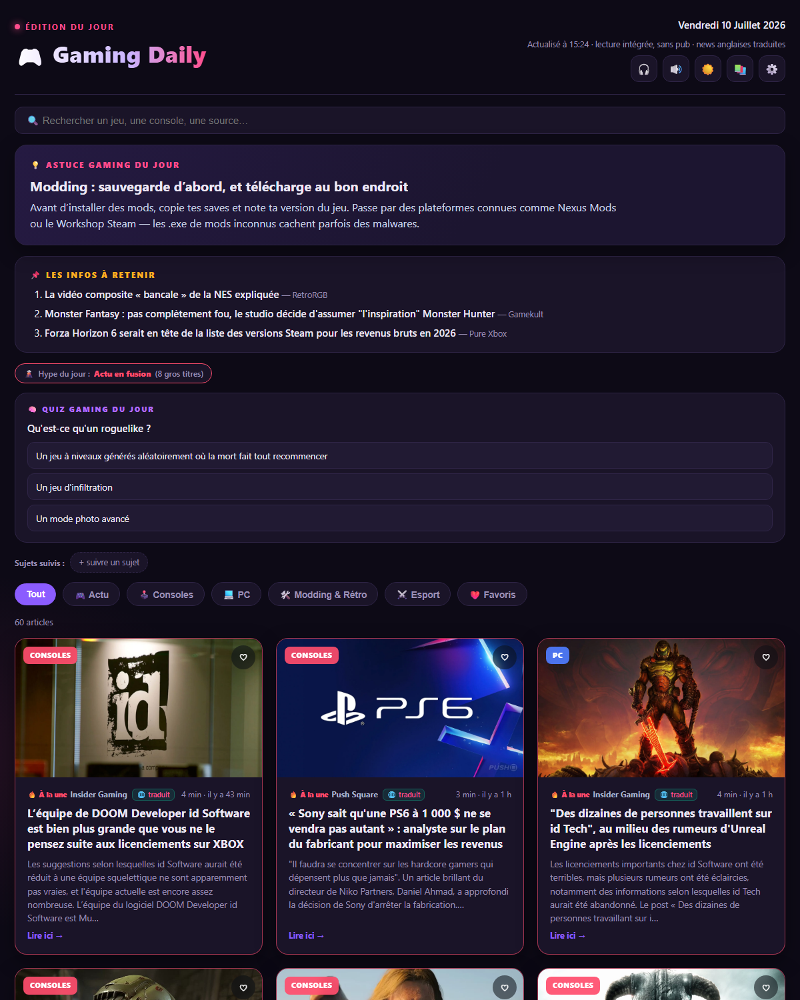

<div align="center">

# 🎮 Gaming Daily

**Ton magazine quotidien 100 % jeu vidéo — actu, consoles, PC, modding & rétro, esport.**

Une seule appli, deux formats : un **exécutable Windows** et une **appli Android**.
Les news sont récupérées directement depuis les flux publics des médias, nettoyées de leur
publicité, traduites de l'anglais si besoin, et lisibles **intégralement dans l'appli**.


<br>



</div>

---

## ✨ Fonctionnalités

- **29 sources jeu vidéo** (FR + EN) : jeuxvideo.com, Gamekult, Gameblog, NoFrag, IGN, GameSpot, Eurogamer, Polygon, PC Gamer, Push Square, Nintendo Life, Wololo, RetroRGB… ainsi que les blogs officiels PlayStation et Xbox.
- **Lecture intégrée, sans pub** : l'article complet est extrait et remis en forme (titres, paragraphes, images), sans quitter l'appli ni subir les bandeaux publicitaires.
- **Traduction automatique** EN → FR des sources anglophones.
- **5 catégories** : 🎮 Actu · 🕹️ Consoles · 💻 PC · 🛠️ Modding & Rétro · ⚔️ Esport.
- **Hype du jour** : détection des grosses annonces (Nintendo Direct, State of Play, rachats, reports, gros leaks…).
- **Confort de lecture** : recherche, favoris hors-ligne, articles lus/non-lus, sujets suivis (épinglage + surlignage), regroupement des doublons entre médias, temps de lecture estimé.
- **Bonus** : glossaire gaming au toucher, quiz du jour, résumé express (TL;DR), mode podcast, synthèse vocale, archives des 7 derniers jours, thème clair/sombre.
- **Mise à jour automatique** : l'appli vous prévient quand une nouvelle version est publiée (voir plus bas).

## 📦 Installation

Les binaires prêts à l'emploi sont disponibles sur la **[page des Releases](https://github.com/wk0t/GamingDaily/releases/latest)**.

### Windows
1. Téléchargez `GamingDaily.exe` depuis la dernière release.
2. Double-cliquez dessus : le magazine du jour se génère et s'ouvre dans votre navigateur.
3. (Facultatif) Lancez `Activer_ouverture_auto.ps1` pour l'ouvrir automatiquement chaque matin à 8 h.

> L'exécutable est un simple lanceur : il n'installe rien et se contente de générer une page HTML locale dans votre dossier temporaire.

### Android
1. Téléchargez `GamingDaily.apk` depuis la dernière release.
2. Ouvrez le fichier et autorisez l'installation depuis cette source (Android le demande pour les applis hors Play Store).
3. Lancez l'appli : les news se chargent et se traduisent à la volée.

### Linux
1. Téléchargez `GamingDaily-x86_64.AppImage` depuis la dernière release.
2. Rendez-le exécutable : `chmod +x GamingDaily-x86_64.AppImage`
3. Double-cliquez dessus (ou lancez-le en ligne de commande). Aucune installation requise.

> L'AppImage embarque tout le nécessaire (Electron) : elle tourne sur la plupart des distributions récentes sans dépendance à installer.

### iOS (sideload)
iOS n'autorise pas l'installation directe d'un `.ipa` comme Android. `GamingDaily-unsigned.ipa` est fourni **non signé** ; deux façons de l'installer :

- **Sideload (partout, gratuit)** : via [AltStore](https://altstore.io) ou [Sideloadly](https://sideloadly.io), qui le signent avec votre identifiant Apple. ⚠️ Avec un compte Apple gratuit, l'app **expire au bout de 7 jours** et doit être re-signée.
- **Union européenne (DMA)** : depuis iOS 17.4, l'app peut être distribuée de façon permanente via une marketplace alternative (ex. AltStore PAL) ou la distribution web — mais cela exige **un compte Apple Developer (99 €/an)** et la **notarisation** par Apple.

> L'app n'est **pas** sur l'App Store. Le `.ipa` est compilé automatiquement par la CI, mais n'est pas testé sur un appareil réel.

## 🔄 Mise à jour automatique

L'application interroge l'API des **GitHub Releases** de ce dépôt et compare son numéro de version
au dernier tag publié. Dès qu'une version plus récente existe, une bannière **« Mettre à jour »**
apparaît en haut de l'écran :

- **Android** : l'APK de la nouvelle version est téléchargé via le gestionnaire de téléchargements du système, puis l'installeur se lance automatiquement.
- **Windows / Linux / iOS** : la bannière ouvre la page de la release, où vous récupérez le nouveau fichier (exe, AppImage ou ipa).

Aucun serveur ni compte n'est nécessaire : tout repose sur les releases publiques de GitHub.
La vérification se fait au démarrage, et une version ignorée n'est plus reproposée tant qu'une plus récente n'est pas sortie.

## 🛠️ Compilation depuis les sources

Le projet ne dépend d'aucun framework lourd : ni Node, ni Gradle. Tout est en PowerShell + outils natifs.

### Prérequis
| Cible   | Outils nécessaires |
|---------|--------------------|
| Windows | Windows 10/11, Windows PowerShell 5.1, .NET Framework (fourni avec Windows) |
| Android | Android SDK Build-Tools 34, JDK 17 (Adoptium), plateforme `android-34` |
| Linux   | Node 20 + `electron-builder` (construit automatiquement par GitHub Actions) |
| iOS     | macOS + Xcode 16 + XcodeGen (construit automatiquement par GitHub Actions) |

### Générer l'exécutable Windows
```powershell
# Le .ps1 est le moteur ; build_exe.ps1 l'embarque dans un petit lanceur .exe
./build_exe.ps1
```

### Générer l'APK Android
```powershell
cd android
./build_apk.ps1
```
Le script enchaîne `aapt` → `javac` → `d8` → `zipalign` → `apksigner` sans passer par Gradle.

### Linux (AppImage) et iOS (IPA)
Ces deux versions sont construites automatiquement par **GitHub Actions** (`.github/workflows/build.yml`) :
un runner Ubuntu produit l'AppImage (l'app Electron du dossier [`linux/`](linux)) et un runner macOS
produit l'IPA non signé (le projet du dossier [`ios/`](ios)). Les binaires sont ensuite attachés à la
release. Pour builder en local :

```bash
# Linux (nécessite Linux ou WSL avec les outils AppImage)
cd linux && npm install && npm run dist

# iOS (nécessite macOS)
cd ios && cp ../android/assets/index.html GamingDaily/index.html && xcodegen generate
xcodebuild -project GamingDaily.xcodeproj -scheme GamingDaily -configuration Release -sdk iphoneos build
```

Les deux réutilisent **la même interface web** (`android/assets/index.html`), copiée au moment du build.

> **⚠️ Clé de signature.** Au premier build, un keystore `android/gamingdaily.jks` est généré
> automatiquement. **Conservez-le précieusement** : Android exige que toutes les mises à jour d'une
> appli soient signées avec la **même** clé. Ce fichier est volontairement exclu du dépôt
> (voir `.gitignore`) et ne doit jamais être publié.

## 🧩 Architecture

```
GamingDaily/
├── GamingDaily.ps1          # Moteur : récupère les flux, extrait/traduit, génère le magazine HTML
├── build_exe.ps1            # Embarque le moteur dans GamingDaily.exe (lanceur)
├── Activer/Desactiver_ouverture_auto.ps1   # Tâche planifiée d'ouverture quotidienne
├── android/
│   ├── AndroidManifest.xml
│   ├── assets/index.html    # L'interface web partagée (JS) — source de vérité de l'UI
│   ├── src/…/MainActivity.java   # WebView + pont natif (fetch, TTS, partage, mise à jour)
│   ├── src/…/NotifReceiver.java  # Rappel quotidien
│   ├── src/…/WidgetProvider.java # Widget d'écran d'accueil
│   └── build_apk.ps1
├── linux/                   # App Electron (réutilise android/assets/index.html) → AppImage
│   ├── main.js · preload.js # Fenêtre + pont (fetch sans CORS, version, cache)
│   └── package.json
├── ios/                     # App WKWebView (réutilise la même interface) → IPA
│   ├── project.yml          # Projet XcodeGen
│   └── GamingDaily/*.swift  # WebView + shim AndroidBridge
└── .github/workflows/build.yml   # CI : build AppImage (Ubuntu) + IPA (macOS)
```

- **Côté PC**, le script PowerShell fait tout le travail (récupération, extraction, traduction) puis
  cuit les données dans une page HTML autonome.
- **Côté Android / Linux / iOS**, la même interface web (`android/assets/index.html`) est réutilisée ;
  chaque plateforme fournit un pont natif (`AndroidBridge` sur Android, un preload Electron sur Linux,
  un `WKScriptMessageHandler` sur iOS) pour ce que le navigateur ne peut pas faire seul : requêtes
  réseau sans restriction CORS, synthèse vocale, partage et mises à jour.
- La logique de lecture (favoris, glossaire, quiz, podcast…) est partagée à l'identique partout.

## 🔒 Vie privée

Gaming Daily ne collecte rien et n'a pas de serveur. Vos favoris, votre historique et vos réglages
restent stockés **localement** (localStorage sur PC, stockage de l'appli sur Android). Les seules
connexions sortantes sont : les flux RSS des médias, le service de traduction gratuit de Google pour
les articles anglais, et l'API des releases de ce dépôt pour la vérification des mises à jour.

## 📰 Sources

Gaming Daily agrège les flux RSS **publics** des médias suivants (liste non exhaustive) :
jeuxvideo.com, Gamekult, ActuGaming, Gameblog, JVFrance, IndieMag, NoFrag, PlayStation Blog,
Xbox Wire, Nintendo-Town, XboxSquad, Gamergen, Frandroid Gaming, IGN, GameSpot, Eurogamer, Kotaku,
Polygon, VGC, Destructoid, Insider Gaming, PC Gamer, Rock Paper Shotgun, Push Square, Nintendo Life,
Pure Xbox, Wololo, Time Extension, RetroRGB.

Chaque article conserve un lien vers sa **source d'origine**. Tout le contenu (textes, images, marques)
appartient à ses ayants droit respectifs. Ce projet est un lecteur personnel, non affilié à ces médias.

## 📄 Licence

Code sous licence **[MIT](LICENSE)**. Le contenu des articles n'est pas couvert par cette licence.

---

<div align="center">
<sub>Fait avec passion pour l'actu du jeu vidéo. 🎮</sub>
</div>
